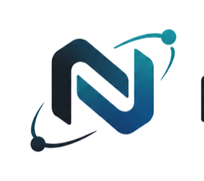
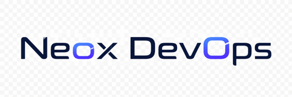

  

  <a href="https://github.com/neoxlabs/neox"><picture>
    <source media="(prefers-color-scheme: dark)" srcset="docs/assets/wordmark-dark.png">
    
  </picture></a>

  <strong>AI SRE for GitHub Actions, Docker, and cloud ops.</strong> 
  面向 GitHub Actions、Docker 与云运维的 AI SRE。

  

  <a href="https://neox-dev.com">Website</a> ·
  <a href="https://github.com/neoxlabs/neox">NeoX</a> ·
  <a href="mailto:support@neox-dev.com">Contact</a>

---

## Capabilities

| Stage | What it does |
|-------|----------------|
| **Sense** | Per-node latency, memory pressure, error-rate shifts, process/container health; events from deploys and feedback |
| **Reason** | Multi-source evidence → root-cause hypothesis (rules + small model triage + strong model for hard cases) |
| **Act** | Tools with risk tiers — low auto, medium approval, high suggest-only |
| **Verify** | Post-action metric checks; rollback or escalate when recovery fails |
| **Learn** | Incident snapshots for replay, audit, and model improvement |

## Trust model

1. Observe before act — every action needs an evidence chain  
2. Least privilege — env / service / command allowlists  
3. Risk tiers — automatic · approval · suggestion  
4. Append-only audit — inputs, tool calls, approvals  
5. Prefer rollback plans before production changes  
6. Humans own critical production actions  

Built on the [NeoX Agent SDK](https://github.com/neoxlabs/neox-sdk) — same production agent loop as NeoX Desktop / CLI, with ops-specific tools and policy.

## Product family

| Product | Domain |
|---------|--------|
| [NeoX](https://github.com/neoxlabs/neox) | Agent workstation (Desktop · CLI · SDK) |
| **NeoX DevOps** | AI SRE / trusted automation |
| [NeoX Commerce](https://github.com/neoxlabs/neox-commerce) | Commerce AI customer service |

## Contact

- Website: [neox-dev.com](https://neox-dev.com)  
- Email: [support@neox-dev.com](mailto:support@neox-dev.com)  
- Help: [neox-dev.com/help](https://neox-dev.com/help)

## License

Proprietary © Neox Labs. See [LICENSE](./LICENSE).
